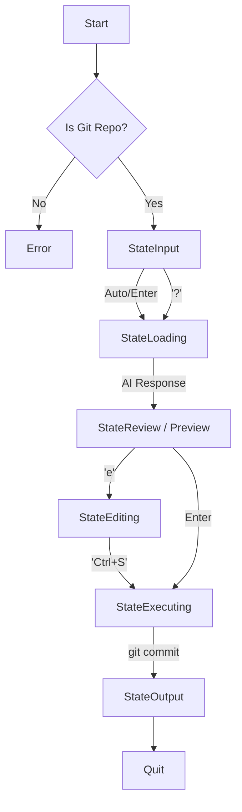

# MarsX Agent & Architecture Guide

本文档旨在指导 AI 助手（如 Cursor Agent）如何维护本项目，同时也描述了 MarsX 内部的 AI 设计架构。

---

## 🤖 AI 维护指南 (Meta-Instructions)

当您（AI Assistant）维护本项目时，请遵循以下规则：

1.  **语言模式**：所有交互、文档、代码注释必须使用 **中文 (Simplified Chinese)**。
2.  **代码风格**：
    *   Go 代码需遵循标准格式 (`gofmt`)。
    *   文件头必须包含功能简述注释。
    *   注释应清晰、简洁。
3.  **架构原则**：
    *   **TUI 层** (`internal/tui`): 负责所有界面渲染，禁止包含 Git/AI 业务逻辑，仅通过 Cmd/Msg 通信。
    *   **逻辑层** (`internal/git`, `internal/ai`): 保持纯净，不依赖 UI 库。
    *   **配置层** (`PROMPTS.md`): 提示词必须外部化，禁止硬编码在 Go 代码中。

---

## 🧠 MarsX AI 架构设计

MarsX 的核心是一个基于状态机的 AI 交互系统。

### 1. 提示词工程 (Prompt Engineering)

Prompt 并不硬编码在二进制文件中，而是优先读取运行目录下的 `PROMPTS.md`。

*   **System Prompt (Commit)**: 角色设定为“Commit Message Generator”。
    *   输入: `git diff --staged` 输出。
    *   输出: 纯文本 Commit Message，无 Markdown 包裹。
    *   规范: Conventional Commits (`feat`, `fix`, `docs` 等)。

*   **System Prompt (Chat)**: 角色设定为“MarsX 助手”。
    *   风格: 简洁、技术向、Markdown 支持。

### 2. 上下文管理 (Context Management)

目前 MarsX 采用 **无状态/短时记忆** 策略：

*   **Commit Mode**: 单次请求。不携带历史记录，只携带 Diff 和 System Prompt。
*   **Chat Mode**: 携带 Session 内的历史记录 (`History []Message`)，以支持多轮对话。

### 3. 状态流转 (State Machine)

UI 基于 Elm Architecture (Bubble Tea)，主要状态流如下：

### 4. 扩展计划

*   **Context Awareness**: 未来将支持读取文件树 (`tree`)，以便 AI 理解项目整体结构，从而在 `init` 或复杂重构任务中给出建议。
*   **Function Calling**: 未来可允许 AI 直接调用 `git add` 或其他 Shell 命令，而不仅仅是生成文本。
